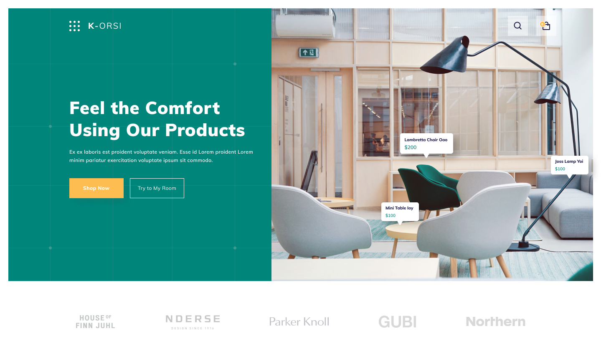

# K-ORSI-SHOP

>This project is an online shopping website of home and office supplies.

## Built With

- Javascript ES6
- React
- Redux

## Live Demo

[Live Demo Link](https://livedemo.com)

## Getting Started

To get a local copy up and running follow these simple example steps.

### Prerequisites
clone the repository locally by running command: $git clone git@github.com:ngodi/k-orsi-shop.git
Navigate into project directory: cd k-orsi-shop

### Setup
Install project dependencies: $npm install

### Usage
run $npm start
### Run tests
run $npm run test

## Author

👤 **Author**

- Github: [@ngodi](https://github.com/ngodi)
- Twitter: [@albertngodi(https://twitter.com/albertngodi)
- Linkedin: [linkedin](https://www.linkedin.com/in/albert-ngodi-b80267174/)

## 🤝 Contributing

Contributions, issues and feature requests are welcome!

Feel free to check the [issues page](issues/).

## Show your support

Give a ⭐️ if you like this project!

## Acknowledgments

- Hat tip to anyone whose code was used
- Inspiration
- etc

## 📝 License

This project is [MIT](lic.url) licensed.
